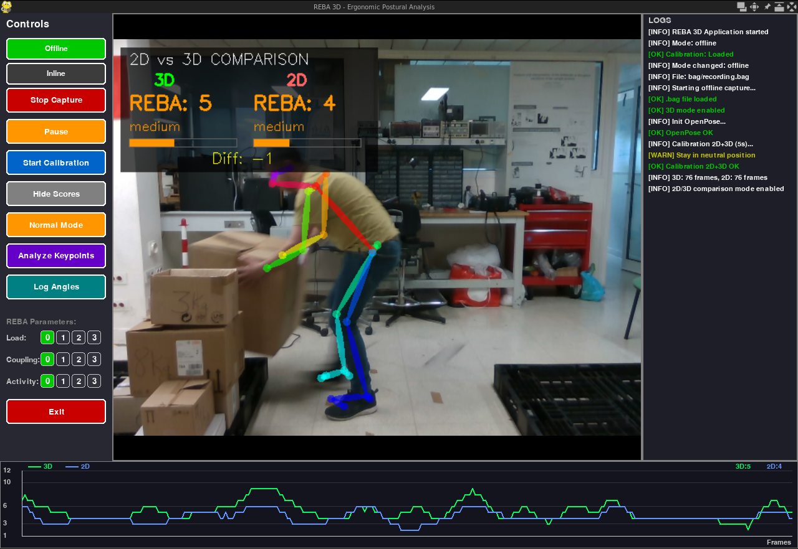

# REBA 3D - Ergonomic Posture Analysis System

Ergonomic posture analysis system using the REBA (Rapid Entire Body Assessment) method with 3D skeleton detection (OpenPose + Intel RealSense).



## Project Structure

```
.
├── src/                Application source code (see src/README.md)
├── scripts/            Auxiliary scripts and data
│   ├── graphs/         Graph generation for the article
│   ├── vicon/          VICON motion capture acquisitions and analyses
│   ├── tests/          Unit tests
│   ├── PEOPLE JSON/    Keypoint data from the 13 experiment subjects
│   └── keypoints/      Sample keypoint data
├── img/                Demo images and videos
├── webpage/            Project presentation webpage
└── index.html          Webpage (root)
```

### `src/`

Main application source code. Contains the `reba_3d` package, configuration files, dependencies and its own README with installation and usage instructions.

### `scripts/`

- **`graphs/`** — Figure generation scripts for the article (heatmaps, PCA, confusion matrices, correlations) and the experimental CSV dataset.
- **`vicon/`** — VICON motion capture analysis scripts (reference ground truth) and associated data files (RealSense/QTM synchronization).
- **`tests/`** — Unit tests for angle calculations, robust calibration and nautical angle integration.
- **`PEOPLE JSON/`** — 3D keypoint data from the 13 subjects (ID_1 to ID_13) used in the experiment.
- **`keypoints/`** — Sample keypoint data with REBA analysis results (2D/3D logs, risk times).
